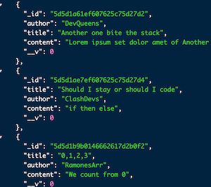

# LyricsDb

A minimalistic **MVC** (Model-View-Controller) Web Application with **CRUD** (create, read, update, delete) functionaly created with Node.js / MongoDB & Mongoose.js / Express.js and JSON
  
API uthentication is provided using Json Web Token & Bcrypt  

#### "As slight as possible"
Since Express >= 4.16.0, body parser has been re-added under the methods express.json() and express.urlencoded(), this web app use only 2 dependency: [Express](https://expressjs.com) & [Mongoose](https://mongoosejs.com)

 

 

## Features
- Database seeding with sample data
- Express 4 Middleware 
- Response Object as JSON
- MVC (Model-View-Controller)
- CRUD (create, read, update, delete)
- Password Hashing
- JWT Authentication
- [Zeit Now](https://zeit.co) deployment configuration

## Setup & run

- Clone the repo
- You need a running instance of MongoDB  
`mongod`
- Install the dependencies  
`npm i`
- Run & Fun  
`npm run dev`

## Npm Scripts

- `npm run dev` uses nodemon (you need it global installed)
- `npm start` uses node

## Demo Examples

[Overview](https://lyricsdb.leandro-berlin.now.sh/) - All the lyrics in DB  
[Single Lyric](https://lyricsdb.leandro-berlin.now.sh/lyrics/5d5d1ae7ef607625c75d27d4) - A single lyric  

## Deployment on Zeit
In order to deploy your app on [Zeit Now](https://zeit.co) you need to create a database reachable from the Internet first. 
You can use the free service of [Mongo Atlas](https://www.mongodb.com/cloud/atlas). You'll also need to edit the mongose.connect() method in `controller/database` to use your Mongo Atlas credentials.
